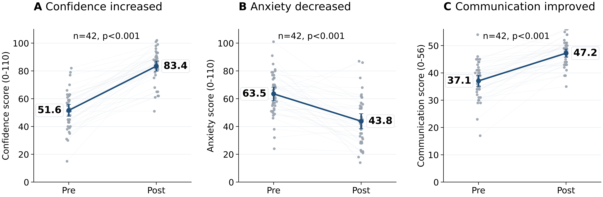

# Mock Paging in a Surgical Boot Camp: Reproducible Analysis Code

This repository contains the reproducible Python analysis pipeline for the manuscript:

**Mock Paging in a Surgical Boot Camp: A Pre/Post Evaluation of Self-Reported Confidence, Anxiety, and Communication With Nurses Among Senior Medical Students**

<p align="center">
  
</p>

## What this repository does

The pipeline:

- loads the de-identified survey CSV
- cleans and validates the dataset
- checks composite score calculations against item-level responses
- generates Table 1, Table 2, and Supplementary Table S1
- generates Figure 1 and Supplementary Figure S1
- writes a manuscript-ready results paragraph and analysis summary

## Repository structure

```text
mock-paging-surgical-bootcamp-analysis/
├── run_analysis.py
├── requirements.txt
├── README.md
├── CITATION.cff
├── .gitignore
├── data/
│   ├── README.md
│   └── raw/
│       └── Mock_Page_data_cleaned.csv
└── results/
```

## Data

The repository expects the input file at:

```text
data/raw/Mock_Page_data_cleaned.csv
```

The script also accepts a custom path through `--input`.

Do not commit restricted raw survey data unless you have explicit approval to do so.

## Setup

```bash
python -m venv .venv
source .venv/bin/activate
pip install -r requirements.txt
```

## Run the analysis

```bash
python run_analysis.py --input data/raw/Mock_Page_data_cleaned.csv
```

Or simply:

```bash
python run_analysis.py
```

if the CSV is already located at `data/raw/Mock_Page_data_cleaned.csv`.

## Outputs

The script writes results to `results/`, including:

- `table_1_baseline_characteristics.csv`
- `table_1_baseline_characteristics.md`
- `table_2_paired_outcomes.csv`
- `table_2_paired_outcomes.md`
- `table_2_paired_outcomes_raw_stats.csv`
- `supplementary_table_s1_item_level_paired_changes.csv`
- `figure_1_composite_pre_post.png`
- `figure_1_composite_pre_post.pdf`
- `supplementary_figure_s1_item_level_mean_changes.png`
- `supplementary_figure_s1_item_level_mean_changes.pdf`
- `composite_validation_summary.csv`
- `class_year_consistency_check.csv`
- `sample_flow.csv`
- `figure_1_source_data.csv`
- `draft_results_paragraph.txt`
- `analysis_console_summary.txt`

## Recommended GitHub workflow

1. Keep the repository private until data sharing and licensing are cleared.
2. Push code, metadata, and documentation first.
3. Add the raw CSV only if you have explicit approval.
4. Tag a release once the manuscript analysis is frozen.
5. Archive the release with Zenodo to obtain a DOI.

## Reproducibility note

The authoritative analysis file in this repository is `run_analysis.py`.

If you keep a notebook for exploration, clear outputs before committing it:

```bash
jupyter nbconvert --clear-output --inplace Mock_page_lean.ipynb
```
